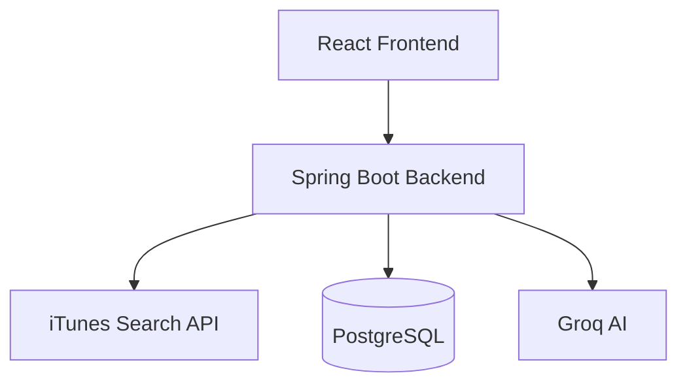

# Music Catalog Insights Platform


Music Catalog Insights Platform is a full-stack web application for exploring albums, building a personal library, and reviewing personal music trends. Users can search albums through the iTunes API, save them to a private library, add ratings and notes, view analytics, generate an AI-backed trend summary, and authenticate securely with JWT.

The project is organized as a React frontend and a Spring Boot backend connected to PostgreSQL. The backend acts as the gateway to iTunes search results and the application’s own library and analytics data, while the frontend provides search, library, recommendations, and analytics in a single responsive interface.

## Table of Contents

- [Live Demo](#live-demo)
- [Features](#features)
- [Tech Stack](#tech-stack)
- [Project Structure](#project-structure)
- [Why Albums](#why-albums)
- [Database Choice](#database-choice)
- [Database Schema](#database-schema)
- [System Architecture](#system-architecture)
- [Application Flow](#application-flow)
- [REST APIs](#rest-apis)
- [Analytics](#analytics)
- [AI Feature](#ai-feature)
- [Recommendations](#recommendations)
- [Recommendation Feature](#recommendation-feature)
- [Good to Have Features](#good-to-have-features)
- [Security](#security)
- [Setup](#setup)
- [Running](#running)
- [Deployment](#deployment)
- [Trade-offs](#trade-offs)
- [Future Improvements](#future-improvements)
- [Screenshots](#screenshots)
- [License](#license)

## Live Demo

- Frontend: `<FRONTEND_RENDER_URL>`
- Backend: `<BACKEND_RENDER_URL>`

## Features

### Authentication

- User registration and login
- JWT-based authentication for protected routes
- Password hashing with BCrypt
- Authorization header support for protected API requests

### Search

- Search albums by title or artist via the iTunes Search API
- Debounced search input in the frontend
- Client-side pagination for search results
- Search summary showing the current page range and total results

### Recommendations

- Personalized recommendations based on the user’s saved album genres
- Queries the iTunes Search API for genre-based album matches
- Filters out albums already saved in the library
- Returns up to eight recommended albums with a reason message
- Recommendations are separate from AI Trend Summary

### Library Management

- Save albums into a private library
- Prevent duplicate albums per user
- Edit a saved album’s rating and notes
- Delete albums from the library

### Analytics

- View charts based on the authenticated user’s saved albums
- Albums by genre — Donut Chart
- Top artists — Horizontal Bar Chart
- Release-year distribution — Vertical Bar Chart
- Tracks per album — Horizontal Bar Chart

### AI

- Generate an AI Trend Summary from saved library data
- Uses a Groq-compatible OpenAI endpoint when configured
- Insights are generated from available data only and do not invent facts

### Performance and Quality

- In-memory caching for repeated iTunes search requests
- Consistent loading, empty, error, and success states in the UI
- Unit tests for backend services and frontend pages/components

## Tech Stack

### Frontend

- React 19
- Vite
- React Router
- Axios
- Recharts
- CSS with Tailwind-compatible styling setup

### Backend

- Java 21
- Spring Boot 3.4.x
- Spring Web
- Spring Security
- Spring Data JPA
- Spring Validation
- JWT authentication with jjwt
- RestClient for external API calls
- Maven

### Database

- PostgreSQL

### Charts

- Recharts

### AI

- Groq-compatible OpenAI endpoint via Spring RestClient

### Testing

- Backend: JUnit 5 and Spring Boot test support
- Frontend: Vitest and React Testing Library

## Project Structure

```text
backend/
  src/main/java/com/musiccatalog/
    config/
    controller/
    dto/
    entity/
    exception/
    repository/
    security/
    service/
  src/test/java/
frontend/
  src/
    components/
    hooks/
    layouts/
    pages/
    routes/
    test/
    utils/
```

## Why Albums?

Albums were chosen because they provide richer metadata than songs or individual artists, including title, artist, genre, release date, track count, artwork, and user-defined ratings and notes. This makes albums a strong fit for library management, personalized recommendations, and analytics.

## Database Choice

PostgreSQL was selected because the application uses relational data with clear relationships between users and albums. It provides ACID transactions, reliable querying, and smooth integration with Spring Boot and JPA.

## Database Schema

### User

| Field      | Type      | Notes                           |
| ---------- | --------- | ------------------------------- |
| id         | bigint    | Primary key                     |
| email      | varchar   | Unique, used for authentication |
| password   | varchar   | BCrypt-hashed password          |
| created_at | timestamp | Creation time                   |

### Album

| Field            | Type      | Notes                            |
| ---------------- | --------- | -------------------------------- |
| id               | bigint    | Primary key                      |
| apple_catalog_id | bigint    | External iTunes album identifier |
| title            | varchar   | Album title                      |
| artist_name      | varchar   | Artist name                      |
| genre            | varchar   | Genre                            |
| release_date     | date      | Release date                     |
| track_count      | int       | Track count                      |
| artwork_url      | varchar   | Album artwork URL                |
| user_rating      | int       | Optional user rating             |
| user_notes       | varchar   | Optional user notes              |
| user_id          | bigint    | Owning user                      |
| created_at       | timestamp | Creation timestamp               |
| updated_at       | timestamp | Last update timestamp            |

A unique constraint on `(user_id, apple_catalog_id)` prevents the same album from being saved multiple times by the same user.

## System Architecture



The React frontend communicates with the Spring Boot backend for search, recommendations, library management, analytics, and AI insights. The backend stores user library data in PostgreSQL, proxies album search requests to iTunes, and forwards analytics facts to the configured AI endpoint.

## Application Flow

```text
User logs in
  ↓
Frontend sends requests to Spring Boot backend
  ↓
Search queries go to iTunes through the backend
  ↓
Saved albums are stored in PostgreSQL
  ↓
Analytics and recommendations are generated from saved albums
  ↓
AI Trend Summary is produced from library facts
```

## REST APIs

| Method | Endpoint                           | Purpose                                                 |
| ------ | ---------------------------------- | ------------------------------------------------------- |
| POST   | `/api/auth/register`               | Register a new user and receive a JWT                   |
| POST   | `/api/auth/login`                  | Authenticate and receive a JWT                          |
| GET    | `/api/search?query=...&type=album` | Search albums through iTunes                            |
| GET    | `/api/recommendations`             | Fetch recommendations based on the user’s saved library |
| GET    | `/api/library`                     | List the current user’s saved albums                    |
| POST   | `/api/library`                     | Save an album to the user’s library                     |
| PUT    | `/api/library/{id}`                | Update an album’s rating and notes                      |
| DELETE | `/api/library/{id}`                | Delete an album from the library                        |
| GET    | `/api/analytics`                   | Retrieve analytics data for the current user            |
| POST   | `/api/ai/insights`                 | Generate an AI trend summary from saved albums          |

All protected endpoints require a JWT in the `Authorization: Bearer <token>` header.

## Analytics

Analytics are generated from the authenticated user’s saved albums and rendered using Recharts. The current frontend includes:

- Albums by genre — Donut Chart
- Top artists — Horizontal Bar Chart
- Release-year distribution — Vertical Bar Chart
- Tracks per album — Horizontal Bar Chart

The analytics panel also includes a separate AI Trend Summary section for text-based insights.

## AI Feature

The AI Trend Summary analyzes the authenticated user’s saved library and creates concise bullet-style insights from the available data. It:

- analyzes saved albums from the user’s library
- identifies genre trends and top artists
- identifies release-year patterns
- considers track count distribution and ratings when available
- composes those facts into a Groq-compatible prompt
- returns a summary generated only from available data

This feature is enabled when `AI_API_KEY` and `AI_BASE_URL` are configured for a compatible Groq endpoint.

## Recommendation Feature

Recommendations are generated from the saved library. The feature:

- reads the user’s saved albums
- extracts the most frequent genres
- queries the iTunes Search API for albums matching each genre
- filters out albums already saved by the user
- returns up to eight recommended albums with a genre-based reason

This approach uses existing genre preferences for album discovery and differs from the AI Trend Summary by focusing on recommendations rather than analytics.

## Good to Have Features

- Debounced search input to reduce unnecessary API calls
- Client-side pagination for search results
- Personalized recommendation cards with genre-based reasons
- Separate AI Trend Summary panel
- In-memory caching for repeated iTunes search queries
- Clear loading, empty, and error states in the UI
- Backend and frontend tests for key flows

## Security

Spring Security and JWT authentication protect the backend API. Passwords are stored with BCrypt, and protected routes validate bearer tokens before allowing access.

## Setup

### Backend

1. Copy `backend/.env.example` to `backend/.env`.
2. Configure your PostgreSQL connection variables and JWT settings.
3. Install dependencies and run the server:

```bash
cd backend
./mvnw spring-boot:run
```

On Windows:

```powershell
cd backend
mvnw.cmd spring-boot:run
```

### Frontend

1. Copy `frontend/.env.example` to `frontend/.env`.
2. Install dependencies:

```bash
cd frontend
npm install
```

### Environment Variables

#### Backend

- `DATABASE_URL`
- `DATABASE_USERNAME`
- `DATABASE_PASSWORD`
- `JWT_SECRET`
- `JWT_EXPIRATION_MS`
- `FRONTEND_URL`
- `AI_API_KEY`
- `AI_MODEL`
- `AI_BASE_URL`

#### Frontend

- `VITE_API_BASE_URL`

## Running

### Backend

```bash
cd backend
./mvnw spring-boot:run
```

### Frontend

```bash
cd frontend
npm run dev
```

### Testing

#### Backend

```bash
cd backend
./mvnw test
```

#### Frontend

```bash
cd frontend
npm run test
```

## Deployment

Frontend (Render):

`<FRONTEND_RENDER_URL>`

Backend API (Render):

`<BACKEND_RENDER_URL>`

Database:

Render PostgreSQL

## Trade-offs

This implementation favors clarity and maintainability over complexity. PostgreSQL was chosen for structured relational data, in-memory caching keeps the backend simple, and client-side search pagination avoids introducing server-side pagination logic for the current dataset.

## Future Improvements

- Server-side pagination for search and library results
- Advanced recommendation engine with artist and metadata matching
- Playlist support for saved collections
- Redis caching for API responses and session state
- OAuth login for social authentication
- Expanded analytics and exportable reports

# Screenshots

## Login & Authentication

### User Registration - 
Create a new account using email and password.


### User Login -
Authenticate securely using JWT-based authentication.


## Search

### Personalized Recommendations -
Displays album recommendations based on the user's saved library and preferred genres.


### Album Search -
Search albums by title or artist using the iTunes Search API.


### Search Pagination -
Browse search results with client-side pagination (6 albums per page).


### Success Notification -
Toast notification displayed after successfully saving an album to the library.


## Library

### My Library -
View all albums saved in your personal music collection.


### Edit Rating & Notes -
Update personal ratings and notes for any saved album.


### Saved Album - 
Example of an album stored in the user's library with rating and notes.


### Delete Album -
Remove albums from the personal library.


### Delete Confirmation -
Success notification displayed after removing an album from the library.


## Analytics

### Analytics Dashboard -
Overview of genre distributionan and top artists. 


### Analytics Dashboard -
Overview of release years, and track count analysis.


## AI Trend Summary

### AI Trend Summary - 
AI-generated insights based on the user's saved albums, highlighting listening patterns, genres, artists, 


## Profile

### User Profile -
Access account information and profile options.


### Logout -
Securely sign out of the application.


## License
MIT
